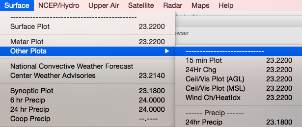
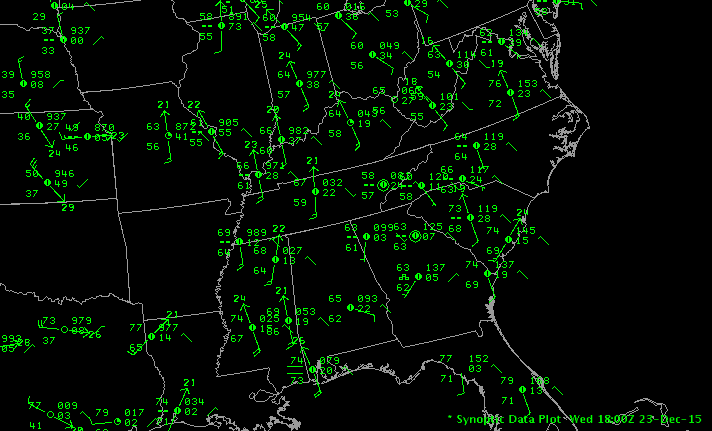
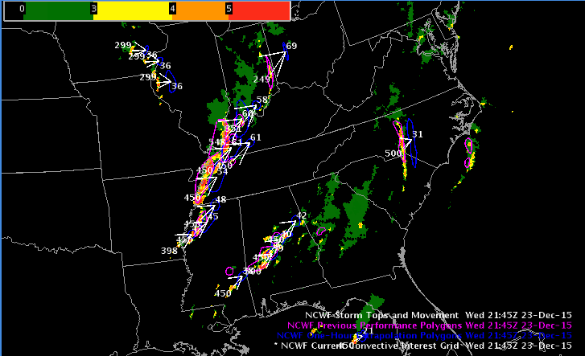
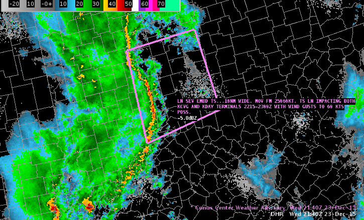
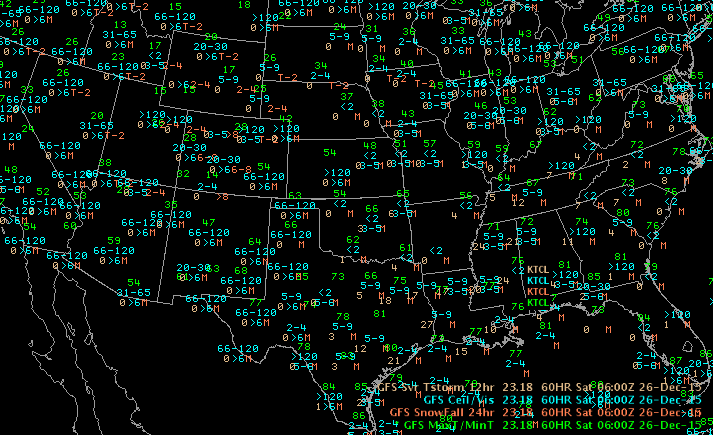

Several of the data sets in the Obs menu can be interrogated (sampled) for more detailed information by clicking mouse Button 1 (B1) over a site. These data sets include METAR, Maritime, and Local. The Obs menu is subdivided into sections that contain related products. These sections are described below.

# METAR

This section contains automatically updating METAR observations, ceiling and visibility plots, wind chill and heat indices, precipitation plots at various time intervals, and quality-checked MSAS observations. The 24hr Chg METAR plot provides the difference between the observed temperature, dewpoint, pressure, and wind from those observed 24 hours earlier. The calculation of the wind difference involves vector subtraction of the "u" and "v" components.

# Synoptic

This section contains automatically updating Synoptic observations, and 6 hour and 24 hour precip plots. Note that this section of the menu is not present at most sites.

# Maritime

This section contains buoy and ship report plots, plus SAFESEAS for the Marine WFOs.

* **MAROB** displays include Station Plots
* The **Other Maritime Plots** cascading menu contains options to display the Fixed and Moving Sea State plots, MAROB Sea State and Cloud/Vis plots, Maritime Clouds/Visibility plots, as well as the Scatterometer Winds.
	* **Sea State** plots provide information on the wave period and height and swell period and height. The wave type, whether a standard wave or a wind wave, is denoted at the origin of the plot by a "+" or a "w", respectively. An "x" at the plot origin signifies that no wave type was reported. If reported, the directions of the primary and secondary swells are denoted with arrows labeled "1" and "2", respectively. The arrows point in the direction the swell is moving.
	* **Maritime Clouds/Visibility** plots contain a station circle denoting sky coverage and the visibility along with standard symbols for obstructions to visibility.
	* **Scatterometer Winds** are obtained from the ASCAT instrument on EUMETSAT's MetOp-A polar orbiting satellite. This instrument sends pulses of radiation to the ocean surface and measures the amount of energy, called backscatter, it receives back. When you sample these observations, the time, satellite ID, wind direction, and wind speed are provided. With the polar orbiting scanning, a given region will generally be sampled about every 12 hours. ASCAT Winds (25 km retrieval resolution but interpolated and displayed at 12.5 km resolution) can be launched from either the CAVE Obs menu or from the Satellite menu You can access the Scatterometer Winds menu options by selecting **Surface** > **Other Maritime Plots** > **Scatterometer Winds**. The ASCAT Scatterometer Ocean Winds product is displayable on CAVE at all scales: N. Hemisphere, North America, CONUS, Regional, State(s), and WFO.

* **Local Storm Reports**: Local Storm Report (LSR) plots are generated from spotter reports
that were entered into the LSR text database and decoded into the correct point data format. The LSR graphical user interface (GUI) is a stand-alone AWIPS application designed to provide forecasters with an easy and quick way to create, manage, and send the LSR public text product. This text product contains noteworthy weather events for which the forecaster has either received or sought out real-time observations.

# National Convective Weather Forecast (AWC)

The [National Convective Weather Forecast](https://www.aviationweather.gov/products/ncwf/) (NCWF) is an automatically generated depiction of current convection and extrapolated significant current convection.  It is a supplement to, but does not substitute for, the report and forecast information contained in [Convective SIGMETs](). The NCWF contains both GRIB and BUFR output. The GRIB output delineates the current convection. The BUFR output includes hazardous convection area polygons, movement arrows, and storm top and speed text information.

The NCWF display bunlde renders **storm tops and movement**, **previous performance polygons**, **1-hour extrapolation polygons**, and **current convective interest grid** (colorbar).

# Center Weather Advisories (CWA)

The [CWA](https://aviationweather.gov/cwamis/help) is an aviation weather warning for conditions meeting or approaching national in-flight advisory (AIRMET, SIGMET or SIGMET for convection) criteria. The CWA is primarily used by air crews to anticipate and avoid adverse weather conditions in the en route and terminal environments. It is not a flight planning product because of its short lead time and duration.

Shown with NEXRAD DHR composite:

# MOS Products

These plots are derived from the MOS BUFR Bulletins. The previous MOS plots were derived from the MOS Text Bulletins. The plots display forecast data for GFS MOS, GFS-Extended MOS, and NGM MOS. Submenus under each model reveal the element choices. These displays include:

* Station Model Plots (Wind, T, Td, Sky Cover, Wx)
* MaxT/MinT (°F)
* Ceiling (agl) / Visibility (ft × 100) (Categorical)
* Probabilities Submenu (6h/12h PoP, 6h/12h Tstorm, 6h/12h Svr-Tstorm, Conditional precipitation types; %)
* QPF 12h (Categorical mid-points; inches)
* QPF 6h (Categorical mid-points; inches)
* Snowfall (6h/12h/24h, Categorical; inches)

# Lightning

This menu item provides three options for displaying lightning flash plots over specified 1 minute, 5 minute, 15 minute and 1 hour intervals.

* **[USPLN (United States Precision Lightning Network)](http://www.unidata.ucar.edu/data/lightning/uspln.html)**: WSI Corporation USPLN lightning data has been made available exclusively to universities for education and research use.  Unidata serves USPLN lightning stroke data from the `LIGHTNING` LDM data feed. Registration is required to request this data, and the free feed is available on an annually renewed basis. USPLN data is not available to the public.
* **[NLDN (National Lightning Detection Network)](http://www.vaisala.com/en/products/thunderstormandlightningdetectionsystems/Pages/NLDN.aspx)**: The NLDN option plots cloud-to-ground (CG) lightning flashes for specified time intervals across the continental United States. NLDN lightning data can be displayed as a grid image displaying the cloud-to-ground density values for a selected resolution (1km, 3km, 5km, 8km, 20km, and 40km).
* **[GLD (Global Lightning Dataset)](http://www.vaisala.com/en/products/thunderstormandlightningdetectionsystems/Pages/GLD360.aspx)**: The GLD option plots cloud-to-ground (CG) lightning flashes for specified time intervals on a global-scale. GLD lightning data can also be displayed as a grid image displaying the cloud-to-ground density values for a selected resolution (1km, 3km, 5km, 8km, 20km, and 40km).
* **[ENI Total Lightning](https://www.earthnetworks.com/networks/lightning/)**: In addition to displaying CG lightning flashes, the Total Lightning option also displays Cloud Flash (CF) lightning and Pulses. CF lightning are lightning flashes which do not strike the ground such as in-cloud, cloud-to-cloud, and cloud-to-air lightning. Lightning pulses are electromagnetic pulses that radiate outward from the lightning channel. ENI total lightning data can be displayed as a grid image displaying the cloud-to-ground, cloud flash, and lightning pulse density values for a selected resolution (1km, 3km, 5km, 8km, 20km, and 40km).
