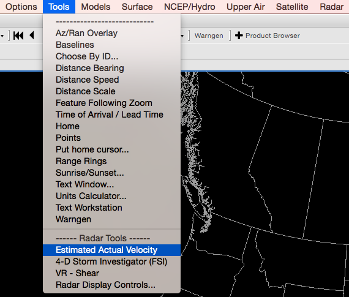
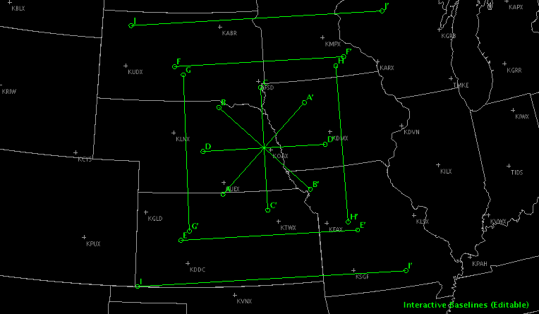
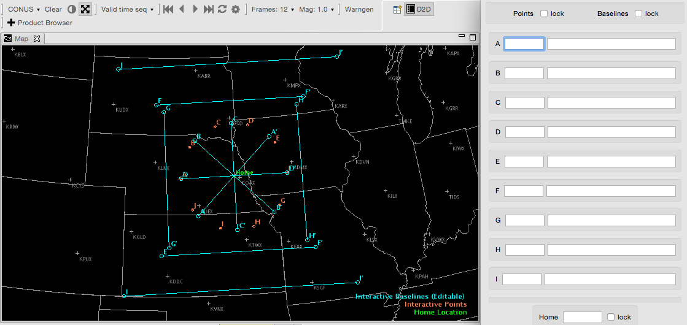
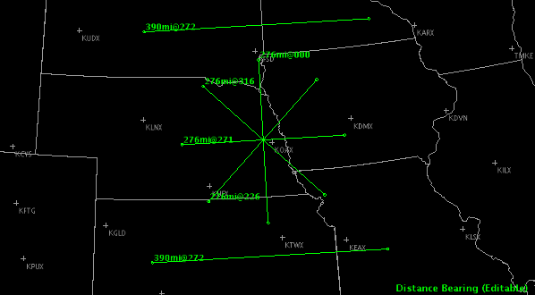
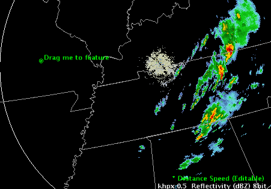
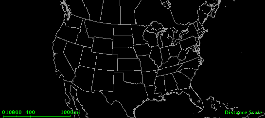
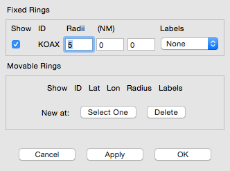
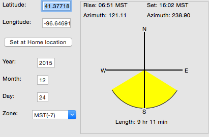
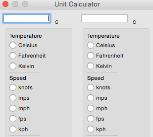

These programs are accessible though the **Tools** dropdown menu.

Many of the tools listed under the Tools menu can be placed into an editable state. Do not enable the "Hide Legends" feature if you want to place a tool in an editable state, because access to editability is by clicking the center mouse button over the Product Legend

## Az/Ran Overlay

This tool displays a movable azimuth/range radar map overlay. The overlay is in the "editable" state when displayed, and can be relocated by clicking the right mouse button.

## Baselines

Selecting Baselines displays 10 lines, labeled A-A' to J-J', along which cross-sections can be constructed from within the Volume Browser. Baselines come up editable.

"Snapping" an Interactive Baseline: If you are zoomed in over an area when you load Interactive Baselines and no Baselines appear, press the right mouse button to "snap" a Baseline to where the mouse cursor is. The system chooses a Baseline that has not been recently used. If you are working with a Baseline, a second click with the right mouse button will return you to the original Baseline, even if you modified another Baseline in the meantime.

## Choose By ID

Choose By ID, which is a function of DMD (Digital Mesocyclone Display), is a method of selecting feature locations. The tool is used to monitor the same feature at a certain location. Without the Choose By ID tool, a monitored feature (over a period of time) could move away from its monitored location and another feature could move in its place. You can use Choose By ID to set points, baselines, and "Home" for conventional locations like METARs and RAOBs (Radiosonde Observations), but its primary use is for the WSR-88D-identified mesocyclone locations. You can also access the Choose By ID tool from the Tools menu on the Volume Browser.

## Distance Bearing

Selecting this tool displays six editable lines, each of which shows the azimuth and range of the labeled end of the line relative to the unlabeled end of the line. You can make the lines editable by clicking the center mouse button over the legend at the lower right of the display. Once in edit mode, a line can be moved as a unit and/or either of its end points can be adjusted.

## Distance Speed

This tool can be used to determine the speed and direction of a storm or any other meteorological feature of interest. Selecting Distance Speed displays a Centroid Marker to move to the location of the storm or feature of interest in any two or more frames of displayed imagery (e.g., a satellite or radar loop). The system then displays a storm track with the direction (degrees) and speed (knots) of movement. When you select the Distance Speed option, the Distance Speed dialog box opens.

* **Mode**: You have the following selections from this option.

	* **Point**: A radio button that allows you to set the Centroid Marker as a single point.

	* **Polyline**: A radio button that allows you to set the Centroid Marker as a polyline.

* **Legend**: You have the following selections from this option.

	* **Time**: A radio button that allows you to display time with the Centroid Marker.

	* **Speed**: A radio button that allows you to display speed with the Centroid Marker.

## Distance Scale

This tool can be used to determine the size of a storm or any other meteorological feature of interest.

## Feature Following Zoom

When you zoom in over a small area to be able to view a feature in detail, animation will often cause the feature to move into and then out of the field of view. This tool allows you to follow a feature of interest even when zoomed in to a small area.

To use this feature, first, you need to identify the location and motion of the feature, using Distance Speed or the WarnGen tracker. Once satisfied that the tracking icon is following the feature of interest, load this tool, and the center of the zoom area will track with the Distance Speed icon. Toggling the overlay off will resume the standard zooming behavior, and toggling it back on will reinvoke the feature following zoom.

## Time of Arrival / Lead Time

Selecting the Time Of Arrival / Lead Time option displays a tracking line from a feature's initial starting point in a past frame to its final position in the current frame. Once the final position is set, an Arrival Point is displayed. You can drag this point anywhere along the line to get the Time Of Arrival / Lead Time and Distance. You can also change the Mode from Point to Circular Front or Polyline anywhere along the line to better represent the feature(s).

## Home

Selecting the Home option displays a marker, which is an "X" with the word "Home" next to it.
Clicking on the Home Location Legend with the center mouse button makes the marker editable; drag the "X" or click with the right mouse button to change its location. When the Home Marker is displayed, use the Sample feature (clock and hold while moving the pointer around the screen) to display the range in miles and azimuth (in degrees) of the pointer location relative to the Home location.

## Points

The Points option initially displays a circular 10-point pattern, labeled A through J on the Map display. Points are used to generate model soundings, time-height cross-sections, time series, and variable vs. height plots using the Volume Browser. As with the Baselines, the locations of these Points can be edited in the following manner:

* **"Snapping" an Interactive Point**: If you are zoomed in over an area when you load Interactive
Points and no Points appear, click the right mouse button to "snap" a Point to where the mouse cursor is positioned. The system chooses a Point that has not been recently used. If you are currently working with a Point, then a second right mouse button click will place another Point at the location of your cursor.

* **Dynamic Reference Map**: When you generate a model sounding, a time-height cross-section, a
time series, or a variable vs. height plot, a small reference map indicating the location(s) of the
plotted sounding(s) is provided in the upper left corner of the Main Display Pane.

Points may be created, deleted, hidden, and manipulated (location, name, font, and color). Points are not limited in terms of number, location, or designation. Points may also be assigned to different groups to facilitate their use. Once the Points tools have been loaded, the addition, deletion, or manipulation of Points can be accomplished in three ways:

1. **Create Point Dialog Box**: The Create Point dialog box is opened by clicking and holding the right mouse button on the map (but not on any exisiting Point) and selecting the "New Point..." option.

	The Create Point dialog box opens with the Lat and Lon text boxes populated with the latitude
and longiture values at the point where you had clicked the right mouse button. The latitude and longitude values can be viewed in "Degrees : Minutes : Seconds," "Degrees : Minutes," or "Degrees Only" (N and S refer to North and South; W and E refer to West and East).

	In the Create Point dialog box, you must:

	* Enter the Point's name
	* Modify the latitude and longitude values
	* Assign the Point's color and font use
	* Assign the Point to a group
	* Select whether the Point is movable or hidden

	By default, individual Points do not have an assigned color. They inherit the color
of the Interactive Points layer reflected in the Interactive Points product legend. You can
change the color of the Interactive Points layer by right clicking on the Interactive Points
product legend and selecting a color from the dropdown list. The selected color then
changes all points not having an assigned color to the new color.

	 Points can be assigned to "<No Group>," which will organize them in the root location containing the group names when accessed by the Edit Points dialog box (see below).

2. **Edit Point Dialog Box**: The Edit Point dialog box is opened by clicking and holding the right mouse button on a Point on the map and selecting the "Edit Point..." option. The latitude and longitude values can be viewed in "Degrees : Minutes : Seconds," "Degrees : Minutes," or "Degrees Only" (N and S refer to North and South; W and E refer to West and East).

	Besides the option of selecting the Edit Points dialog box, you also have the option
of selecting "Hide Point," "Delete Point," or "Move Point." Once hidden, the Point can be
unhidden using the Points List dialog box, where you would uncheck the checkbox under
the "Hidden" column adjacent to the Point that was hidden (see below). If "Delete Point" is
selected, a pop-up opens to confirm whether you want to delete the Point. Selecting the
"Move Point" option moves the Point to wherever you place the cursor on the map.

3. **Points List Dialog Box**: The Points List dialog box is opened by clicking and holding the right mouse button on the Interactive Points product legend and selecting the "Edit Points..." option.

	The Points List dialog box lists all the available groups and Points. Groups can be expanded to
review the list of Points assigned to that group by clicking the arrow next to the group name.
Initially, the default set of Points (A-J) are listed in the D2D Group, as shown above. In the
Points List dialog box, Points and groups may be dragged into and out of other groups to create
or disassemble subgroups. The Points List dialog box also includes three columns.

	* **Point Name**: Lists the group name and designated Points.
	* **Movable**: Checking the checkbox adjacent to the Point disables the Point from being
moved.
	* **Hidden**: Checking the checkbox adjacent to the Point hides the Point on the map.

## Put home cursor

The Put home cursor tool provides an easy way to locate a METAR observation station, a city and
state, or a latitude/longitude coordinate. For Canada and Mexico, only the METAR observation stations and latitude/longitude coordinates are accessible. When you select Put home cursor from the Tools dropdown menu, the Home marker X is displayed and the Put Home Cursor dialog box opens.

You can use the Home marker, as previously described in the Home Tool, and the new Home location
(station, city/state, or latitude/longitude) is identified in the Put Home Cursor dialog box.
Another way to use this tool is to type in the station, city and state, or latitude and longitude, and select Go, or hit Enter on the keypad, to move the Home marker to the specified location. The new location's nearest METAR site, city and state, and latitude and longitude appear in the Put Home Cursor dialog box. The Put Home Cursor dialog box contains the following options.

* **Location Selection**: There are three ways to find a desired location. Once you choose the
Station, City/State, or Lat/Lon radio button, an Entry Box is activated next to the respective label within the Put Home Cursor dialog box. Enter the desired location information.

* **Go**: This menu button initiates the search for the desired station, city/state, or latitude/longitude. The Home marker jumps to the newly specified location.

## Range Rings

The Range Rings Tool displays adjustable range rings around locations of interest to your local office. When you select Range Rings from the Tools dropdown menu, the Range Rings legend appears in the Main Display Pane. The tool comes up editable, and the rangeRing dialog box opens. (Clicking B2 over the legend toggles tool editability and closes/opens the rangeRing dialog box.) Within this dialog box, you can toggle on/off any of the target locations using the square selectors. Adjust the size of the radii (in nautical miles) by typing a new value in the entry boxes associated with each location and pressing the Apply button. You can also add labels at the center of the range ring and/or at any of the radial distances using the Labels Options menu associated with each location. Using the Movable Rings, you can add a new location at a specific point by using the Interactive Points Tool, or by typing in latitude/longitude coordinates. There is no practical limit on the number of new locations you can add to the display. The list of locations is pre-set but can be customized at a field site

## Sunset/Sunrise

By typing a date, as well as the latitude and longitude of a location into the Sunrise/Sunset Tool dialog box, you can obtain the time (for any time zone) of sunrise and sunset, as well as the total length of daylight for that date. Additional features include the ability to calculate the sunrise/sunset in a different hemisphere, and the azimuthal angles, relative to true north, of the sunrise and sunset.

## Text Window

Selecting this option brings up a Text Display window that behaves in the same way, except for scripts, as a window on the Text Workstation.

## Units Calculator

This tool converts the units of the first column into differing units of the second column. The units are grouped into temperature, velocity, distance, time, and atmospheric pressure. First, simply type the number and select the units of the value you wish to convert in the firstcolumn entry box. Then in the second column, select the desired units to which you want the original value converted. The new value will appear in the second column entry box.

## Text Workstation
