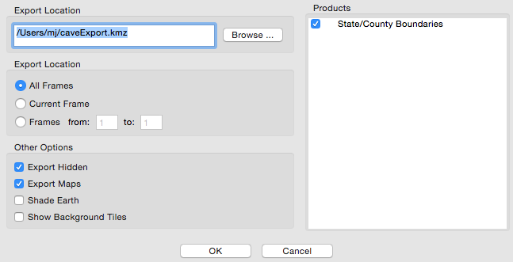
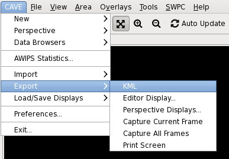

## Export Images

**File > Export > Image**

which captures a screenshot of the current view

---

## Export KML

**File > Export > KML**

The "Export" submenu also includes a "KML" option, which allows users to save D2D displays or
GFE grids in the KML (Keyhole Markup Language) file format. When zipped (compressed), the KML
file format forms a KMZ file, which can be used in applications such as Google Earth.

The KML dialog box includes options to select frames to export. This includes exporting all frames,
the current/displayed frame, a range of frames, and, in GFE, the selected time range as highlighted in
the Grid Manager. Additional options are available for selection under the "Other Options" section:

* **Export Hidden**: When selected, all displayed and hidden products listed in the Product Legend section of the Main Display Pane will be exported.

* **Export Maps**: When selected, all enabled maps displayed within the Main Display Pane will be
exported.

* **Shade Earth**: When selected, a shaded background is applied to the exported product. If loaded in Google Earth, the earth will be overlaid with a black backdrop, and data will be displayed as it would in D2D with a black background.

* **Show Background Tiles**: When selected, data (such as plot data) will display on top of black
tiles when loaded in Google Earth.

---

## CAVE Import Formats

CAVE supported the following geo-referenced data files. CAVE can import the following through formats through the **CAVE** -> **Import** menu.

1. **GIS Data**

2. **BCD File**

3. **GeoTIFF**

4. **LPI File**

5. **SPI File**

6. **Displays**

---

## CAVE Export Formats

CAVE can export to the following through the **CAVE** -> **Export** menu.

1. **KML**

2. **Editor Display**

3. **Perspective Display**

4. **Capture Current Frame**

5. **Capture All Frames**

6. **Print Screen**

